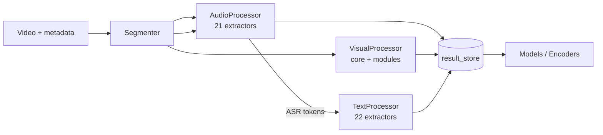

# DataProcessor

Мультимодальный пайплайн извлечения признаков из видео для **TrendFlowML** (прогноз популярности и аналитика контента).  
Обрабатывает три модальности — **visual**, **audio**, **text** — и пишет воспроизводимые артефакты в **per-run result store** (NPZ + manifest).

---

## Что это (one-liner для портфолио)

End-to-end feature pipeline: Segmenter → Audio/Text/Visual processors → NPZ artifacts с версионированными схемами, fail-fast контрактами и production-oriented observability (API, Triton, Prometheus).

---

## Архитектура (высокий уровень)



| Сервис | Роль |
|--------|------|
| [Segmenter](Segmenter/) | Кадры, audio.wav, segments.json — единый sampling |
| [AudioProcessor](AudioProcessor/) | 21 audio extractor |
| [TextProcessor](TextProcessor/) | 22 text extractor |
| [VisualProcessor](VisualProcessor/) | Core providers + modules |
| [embedding_service](embedding_service/) | Semantic DB / FAISS |
| [dp_models](dp_models/) | ModelManager, offline weights |
| [triton](triton/) | GPU inference (CLIP, MiDaS, RAFT, …) |
| [api](api/) | HTTP API + worker (опционально) |

---

## С чего начать

| Цель | Документ |
|------|----------|
| **Портфолио / собеседование** | [docs/PORTFOLIO_INTERVIEW_GUIDE.md](docs/PORTFOLIO_INTERVIEW_GUIDE.md) |
| **Живое демо (runbook)** | [docs/PORTFOLIO_DEMO_RUNBOOK.md](docs/PORTFOLIO_DEMO_RUNBOOK.md) |
| **DAG компонентов** | [docs/reference/COMPONENT_GRAPH_INDEX.md](docs/reference/COMPONENT_GRAPH_INDEX.md) |
| Навигация по всей документации | [docs/MAIN_INDEX.md](docs/MAIN_INDEX.md) |
| Карта папок (source vs runtime) | [docs/TOP_LEVEL_LAYOUT.md](docs/TOP_LEVEL_LAYOUT.md) |
| Контракты (NPZ, no-fallback) | [docs/contracts/CONTRACTS_OVERVIEW.md](docs/contracts/CONTRACTS_OVERVIEW.md) |
| Прогресс нормализации | [docs/PORTFOLIO_PROGRESS_LOG.md](docs/PORTFOLIO_PROGRESS_LOG.md) |
| Итог сессии (полный отчёт) | [docs/PORTFOLIO_SESSION_SUMMARY_2026-05-29.md](docs/PORTFOLIO_SESSION_SUMMARY_2026-05-29.md) |
| Production hardening (Phase 8) | [docs/PRODUCTION_HARDENING_PLAN.md](docs/PRODUCTION_HARDENING_PLAN.md) |
| Env alignment (local/docker/E2E) | [docs/ENV_ALIGNMENT.md](docs/ENV_ALIGNMENT.md) |
| Configs index | [configs/README.md](configs/README.md) |
| CI smoke (GitHub Actions) | [docs/CI_SMOKE.md](docs/CI_SMOKE.md) |
| E2E preflight / runbook | [docs/E2E_PREFLIGHT.md](docs/E2E_PREFLIGHT.md) |

### Зависимости по процессорам

- [AudioProcessor/docs/EXTRACTOR_DEPENDENCIES.md](AudioProcessor/docs/EXTRACTOR_DEPENDENCIES.md)
- [TextProcessor/docs/EXTRACTOR_DEPENDENCIES.md](TextProcessor/docs/EXTRACTOR_DEPENDENCIES.md)
- [VisualProcessor/docs/EXTRACTOR_DEPENDENCIES.md](VisualProcessor/docs/EXTRACTOR_DEPENDENCIES.md)

---

## Быстрый запуск (локально)

```bash
# 1. Окружение
cp DataProcessor/env.example .env   # отредактировать DP_MODELS_ROOT, storage

# 2. Модели (первый раз)
export DP_MODELS_ROOT=/path/to/dp_models/bundled_models
./DataProcessor/scripts/hf_download_all.sh   # при необходимости

# 3. Один видео-прогон (пример)
python3 DataProcessor/main.py \
  --video-path /path/to/video.mp4 \
  --global-config DataProcessor/configs/global_config.yaml \
  --platform-id youtube \
  --video-id demo_1 \
  --run-id run_1
```

Результаты: `DataProcessor/dp_results/<platform>/<video>/<run>/` (локально) или S3/MinIO в prod.

**E2E со backend + Triton:** `backend/docs/E2E_RUNBOOK.md`, `backend/scripts/start_e2e_stack.sh`

---

## Масштаб (для резюме)

| Область | Масштаб |
|---------|---------|
| Audio extractors | 21 |
| Text extractors | 22 |
| Visual components | 29 (core + identity + modules) |
| Документация | Контракты Audit v3/v4, per-component README/SCHEMA |
| Infra | Triton, Celery/Redis, Prometheus/Grafana, Docker Compose |

---

## Принципы (prod-ready)

- **NPZ = source of truth**, manifest per run
- **No-fallback**: отсутствие dependency / segment family → error
- **Segmenter-only sampling**: extractors не придумывают свои frame_indices
- **ModelManager-only**: модели локально, без сети в audited runs
- **Версионирование**: `schema_version`, `model_signature` в meta

Подробнее: [docs/architecture/PRODUCTION_ARCHITECTURE.md](docs/architecture/PRODUCTION_ARCHITECTURE.md)

---

## Ограничения и техдолг (честно)

См. [docs/PORTFOLIO_INTERVIEW_GUIDE.md — § Tech debt](docs/PORTFOLIO_INTERVIEW_GUIDE.md#tech-debt-и-границы-v1)

---

## Связь с репозиторием

- Продуктовое описание: [../doc.md](../doc.md)
- Индекс всего TrendFlowML: [../docs/MAIN_INDEX.md](../docs/MAIN_INDEX.md)
- Backend: [../backend/](../backend/)
