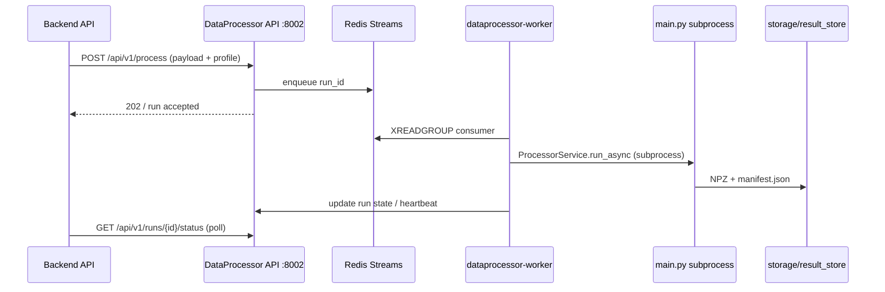

# DataProcessor API → Worker → Result Store (P2.5)

Один операционный путь для queue mode: от submit до артефактов на диске.

Связано: [DATAPROCESSOR_API_ARCHITECTURE.md](DATAPROCESSOR_API_ARCHITECTURE.md) · [ENV_ALIGNMENT.md](ENV_ALIGNMENT.md) · [E2E_PREFLIGHT.md](E2E_PREFLIGHT.md)

---

## 1. Поток данных



---

## 2. Ключевые компоненты

| Компонент | Путь | Роль |
|-----------|------|------|
| HTTP API | `DataProcessor/api/main.py` | Enqueue, status, health |
| Endpoint | `api/endpoints/process.py` | `POST /api/v1/process` |
| Queue | `api/services/queue.py` | Redis Streams, backpressure |
| Worker | `api/worker.py` → `api/services/worker.py` | Consumer loop, heartbeat |
| Runner | `api/services/processor.py` | Subprocess `DataProcessor/main.py` |
| Paths | `api/utils/result_store_path.py` | Совместимость с CLI layout |

---

## 3. Payload (минимум для worker)

Worker ожидает поля из `ProcessRequest` (см. `api/schemas/requests.py`):

- `run_id`, `platform_id`, `video_id`
- `video_path` или `video_url`
- `profile_path` / inline profile JSON
- опционально `global_config_path` — unified YAML для всех processors

Backend строит payload в `backend/app/services/dataprocessor.py` и `dataprocessor_adapter.py`.

---

## 4. Storage (обязательное выравнивание)

API worker пишет в `STORAGE_ROOT`; CLI `main.py` — в `TREND_FS_ROOT`.  
**Должны совпадать** для одного run:

```bash
export STORAGE_TYPE=fs
export STORAGE_ROOT="/path/to/TrendFlowML/storage"
export TREND_STORAGE_BACKEND=fs
export TREND_FS_ROOT="${STORAGE_ROOT}"
```

E2E: `source backend/scripts/e2e_env.sh` — уже выровнено.

---

## 5. Локальный запуск (без Backend)

```bash
cd DataProcessor
source ../backend/scripts/e2e_env.sh   # или свой .env

# Terminal 1 — API
.data_venv/bin/uvicorn api.main:app --host 0.0.0.0 --port 8002

# Terminal 2 — worker
.data_venv/bin/python -m api.worker
```

Submit (пример):

```bash
curl -s -X POST http://localhost:8002/api/v1/process \
  -H "Content-Type: application/json" \
  -H "X-API-Key: dev-key" \
  -d '{
    "run_id": "manual-test-001",
    "platform_id": "youtube",
    "video_id": "test_video",
    "video_path": "/abs/path/to/video.mp4",
    "global_config_path": "/abs/path/to/DataProcessor/configs/portfolio_demo.yaml"
  }'
```

Status:

```bash
curl -s http://localhost:8002/api/v1/runs/manual-test-001/status -H "X-API-Key: dev-key"
```

---

## 6. Где смотреть артефакты

Per-run layout (FS):

```
storage/result_store/{platform_id}/{video_id}/{run_id}/
  manifest.json
  segmenter/ ...
  audio_processor/ ...   # если enabled
  visual/ ...            # если enabled
```

Frames (Segmenter):

```
storage/frames_dir/{video_id}/video/
  metadata.json
  batch_*.npy
```

---

## 7. Отладка

| Симптом | Проверка |
|---------|----------|
| Run stuck in `queued` | Worker запущен? `REDIS_URL` совпадает у API и worker? |
| 503 + Retry-After | Backpressure — `MAX_CONCURRENT_RUNS`; подождать или scale worker |
| Empty result_store | `STORAGE_ROOT` ≠ `TREND_FS_ROOT` |
| Segmenter OK, audio off | Backend default profile; нужен `global_config_path` |
| Subprocess exit ≠ 0 | Лог worker: `backend/.e2e/logs/*/dataprocessor-worker/process.log` |

---

## 8. E2E (полный стек)

```bash
./backend/scripts/setup_e2e_infra.sh      # первый раз
export E2E_USE_PORTFOLIO_DEMO_CONFIG=1    # опционально: audio tier-0
./backend/scripts/start_e2e_stack.sh --with-infra
cd backend && source scripts/e2e_env.sh
.venv/bin/python scripts/e2e_run_to_complete.py \
  --source-url "https://www.youtube.com/watch?v=-Q6fnPIybEI" \
  --with-dataprocessor --timeout 3600
```

См. [E2E_PREFLIGHT.md](E2E_PREFLIGHT.md).
