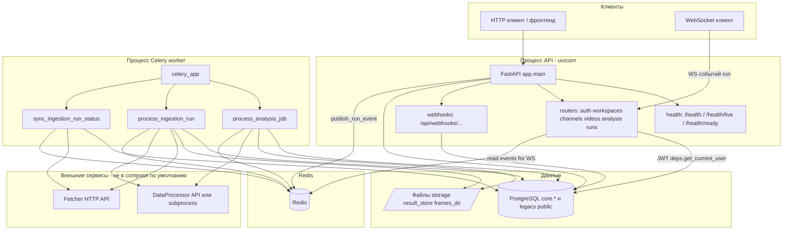
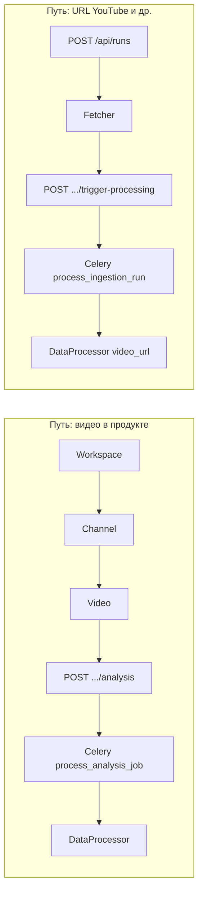

# TrendFlow Backend

Сервис в каталоге `backend/` — это **REST API на FastAPI**, оркестратор фоновой обработки (**Celery**), индекс метаданных в **PostgreSQL** (прежде всего схема **`core.*`**), **Redis** (брокер/результаты Celery и pub/sub для событий прогресса), плюс работа с **файловым хранилищем** (`storage/`, `result_store`, кадры и т.д.). Интеграции: **Fetcher** (ингестия по URL) и **DataProcessor** (тяжёлый пайплайн анализа).

**Быстро для ревью:** из корня монорепозитория выполните `docker compose -f backend/docker-compose.yml up --build`, затем откройте [http://localhost:8080/docs](http://localhost:8080/docs) и [http://localhost:8080/health/ready](http://localhost:8080/health/ready).

**Итог по демонстрации и карта всех материалов для работодателя:** [docs/DEMO_AND_PORTFOLIO.md](docs/DEMO_AND_PORTFOLIO.md).

Дополнительно: [docs/MAIN_INDEX.md](docs/MAIN_INDEX.md) (оглавление документации), [docs/OVERVIEW.md](docs/OVERVIEW.md) (потоки данных), [docs/adr/README.md](docs/adr/README.md) (ADR: Celery, Redis pub/sub, manifest), [docs/PORTFOLIO_READINESS_CHECKLIST.md](docs/PORTFOLIO_READINESS_CHECKLIST.md), [docs/STANDALONE_REPOSITORY.md](docs/STANDALONE_REPOSITORY.md) (вынос backend в отдельный репозиторий).

---

## Обязанности сервиса (согласовано с кодом и `docs/OVERVIEW.md`)

| Область | Что делает backend |
|--------|---------------------|
| **HTTP API** | Auth, workspaces, channels, videos, analysis jobs, ingestion runs, subscriptions; webhooks DataProcessor под префиксом `/api`. |
| **Фоновые задачи** | Celery: `process_analysis_job`, `process_ingestion_run`, `sync_ingestion_run_status` (для последней нужен **beat**), др. — см. пакет `app/tasks/`. |
| **БД** | Модели v2 в `app/dbv2/models.py`, миграции Alembic в `alembic/versions/`. |
| **События / WS** | Публикация в Redis (`app/services/events.py`); WebSocket эндпоинт ingestion run — в роутере runs. |
| **Файлы** | Размещение артефактов и путей под DataProcessor; `manifest.json` и NPZ — **source of truth** результатов, БД — индекс. |

Подробные сценарии (workspace → video → analysis, YouTube URL → Fetcher → processing) описаны в [docs/OVERVIEW.md](docs/OVERVIEW.md).

---

## Структура каталога `backend/`

| Путь | Назначение |
|------|------------|
| `app/main.py` | Точка входа FastAPI, CORS, startup (dirs, опционально `create_all`, seed профилей). |
| `app/worker.py` | Приложение Celery, расписание beat для `sync_ingestion_run_status`. |
| `app/tasks/` | Celery-задачи: `analysis.py`, `ingestion.py`, публикация событий `events.py`, manifest/артефакты `manifest.py`. |
| `app/routers/` | Маршруты: `auth`, `workspaces`, `channels`, `videos`, `analysis`, `runs`, `webhooks`, `health`. |
| `app/dbv2/` | ORM-модели и enum’ы для схемы `core.*`. |
| `app/services/` | Адаптер DataProcessor, клиент Fetcher, storage, события, профили, качество. |
| `alembic/` | Миграции БД (legacy `public` + `core`). |
| `tests/` | Pytest: `unit/`, `integration/`, `api/`, контракты с DataProcessor. |
| `docker-compose.yml`, `docker-compose.standalone.yml`, `Dockerfile` | Демо-стек: Postgres, Redis, API, worker (`standalone` — профили из `./profiles` для отдельного репо). |
| `docs/` | Спецификации API, БД, операций, интеграций. |

---

## Архитектура: компоненты и связи

Ниже — логическое разбиение процессов и зависимостей (в Docker **api** и **worker** — отдельные контейнеры с одним образом).



### Два основных pipeline’а обработки



Интеграция с Fetcher по шагам: [docs/FETCHER_INTEGRATION.md](docs/FETCHER_INTEGRATION.md). Контракт с DataProcessor: [docs/reference/DATAPROCESSOR_CONTRACT.md](docs/reference/DATAPROCESSOR_CONTRACT.md).

---

## Запуск в Docker (рекомендуется для демо)

### Предварительные условия

- Установлены **Docker** и **Docker Compose** v2 (нужен **BuildKit** и поддержка `additional_contexts`).
- Репозиторий клонирован так, что рядом существуют каталоги **`backend/`** и **`DataProcessor/profiles/`** (профили копируются в образ отдельным контекстом сборки; при отсутствии каталога сборка завершится ошибкой `COPY --from=profiles`).

### Команда

Из **корня** монорепозитория TrendFlowML:

```bash
docker compose -f backend/docker-compose.yml up --build
```

### Что поднимается (см. `docker-compose.yml`)

| Сервис | Назначение | Порты на хосте |
|--------|------------|----------------|
| `db` | PostgreSQL 16 | **5432** |
| `redis` | Redis 7 | **6379** |
| `api` | После `alembic upgrade head` — `uvicorn` на **8080** | **8080** |
| `worker` | `celery ... worker` | — |

Том: данные Postgres в именованном volume `backend_pg_data`; каталог репозитория **`../storage`** монтируется в контейнеры как **`/srv/storage`** (общее хранилище с хоста).

Переменные в compose задают как минимум `TF_BACKEND_DB_DSN`, `TF_BACKEND_REDIS_URL`, `TF_BACKEND_JWT_SECRET`, `TF_BACKEND_DB_AUTO_CREATE=false`, `TF_BACKEND_CORS_ORIGINS`. Секрет для демо можно переопределить:

```bash
export TF_BACKEND_JWT_SECRET="$(openssl rand -hex 32)"
export TF_BACKEND_CORS_ORIGINS="http://localhost:3000"
docker compose -f backend/docker-compose.yml up --build
```

**Важно:** контекст сборки образа — **только** `backend/` плюс контекст **`profiles: ../DataProcessor/profiles`**. Так Docker не упаковывает весь монорепозиторий (и не уходит в десятки ГБ «transferring context»). Подробнее см. комментарии в `Dockerfile` и [docs/OPERATIONS.md](docs/OPERATIONS.md).

**Beat** в compose **не** запускается: периодический `sync_ingestion_run_status` при полном сценарии с Fetcher обычно требует отдельного процесса `celery ... beat` — см. `app/worker.py` и [docs/RUNS_AND_WORKERS.md](docs/RUNS_AND_WORKERS.md).

### После старта

- OpenAPI / Swagger: **http://localhost:8080/docs**
- Liveness: `GET http://localhost:8080/health` или `/health/live`
- Readiness (БД + Redis): `GET http://localhost:8080/health/ready` — при сбое зависимости **503**

Fetcher, DataProcessor, ffprobe в этот compose **не входят**; для E2E с ними см. [docs/E2E_PIPELINE_NO_TEXT.md](docs/E2E_PIPELINE_NO_TEXT.md) и остальные E2E-документы в корне репозитория.

---

## Локальная разработка без Docker

Рабочая директория для команд — **`backend/`** (чтобы находились `app.*` и `alembic.ini`).

1. **Python 3.10+**, установленные **PostgreSQL** и **Redis**; для части фич — **ffprobe** (см. [docs/OPERATIONS.md](docs/OPERATIONS.md)).
2. Создайте окружение и зависимости:

   ```bash
   cd backend
   python3 -m venv .venv
   .venv/bin/python -m pip install -r requirements.txt
   ```

3. Скопируйте [`.env.example`](.env.example) в `.env` и задайте как минимум `TF_BACKEND_JWT_SECRET`, `TF_BACKEND_DB_DSN`, `TF_BACKEND_REDIS_URL` (при необходимости `TF_BACKEND_CORS_ORIGINS`, пути `TF_BACKEND_*` — см. [docs/CONFIGURATION.md](docs/CONFIGURATION.md)).

4. Примените миграции:

   ```bash
   .venv/bin/alembic upgrade head
   ```

5. Запуск API (порт по желанию; в документах встречается и 8000, и 8080 в Docker):

   ```bash
   .venv/bin/uvicorn app.main:app --reload --host 0.0.0.0 --port 8000
   ```

6. В отдельных терминалах при необходимости:

   ```bash
   cd backend
   .venv/bin/celery -A app.worker:celery_app worker -l info
   ```

   ```bash
   cd backend
   .venv/bin/celery -A app.worker:celery_app beat -l info
   ```

Поведение на startup API описано в разделе Docker/OPERATIONS выше и в [docs/OPERATIONS.md](docs/OPERATIONS.md).

---

## Документация API и ограничения

- Сводка REST и WebSocket: [docs/API.md](docs/API.md)
- Безопасность (JWT, CORS, WebSocket `?token=`, **`TF_BACKEND_DEPLOYMENT_ENV`** + слабый secret): [docs/SECURITY.md](docs/SECURITY.md)
- Расхождения с «идеальным» прод-контрактом (billing, WS auth, cancel, и т.д.): [docs/GAPS_AND_ALIGNMENT.md](docs/GAPS_AND_ALIGNMENT.md)

---

## Для портфолио (кратко)

- **Стек:** FastAPI, PostgreSQL, SQLAlchemy 2, Alembic, Celery, Redis, WebSocket.
- **Интеграции:** Fetcher (`POST /api/runs`, trigger, статусы); DataProcessor (analysis и ingestion).
- **Качество:** pytest, **Ruff** (`ruff check app`), отчёт покрытия **coverage.xml** в CI; workflow: [.github/workflows/backend-ci.yml](../.github/workflows/backend-ci.yml). Подробности: [docs/TESTING.md](docs/TESTING.md).

Перед созвоном или отправкой ссылки на репозиторий пройдите **чеклист в [docs/DEMO_AND_PORTFOLIO.md](docs/DEMO_AND_PORTFOLIO.md)** (раздел 2).

## Тесты

```bash
cd backend
.venv/bin/python -m pip install -r requirements.txt
.venv/bin/ruff check app
.venv/bin/python -m pytest tests/ -v --tb=short
```

Быстрый набор **без** PostgreSQL на хосте (в основном unit + contract):

```bash
.venv/bin/python -m pytest tests/ -m "unit or contract" -q
```

Полный прогон с маркером **integration** рассчитывает доступную БД по `TF_BACKEND_DB_DSN`. Coverage как в CI (в т.ч. **`coverage.xml`** в `backend/`):

```bash
TF_BACKEND_JWT_SECRET=ci-secret-do-not-use-in-production \
TF_BACKEND_DB_DSN=postgresql+psycopg://u:p@localhost/db \
TF_BACKEND_REDIS_URL=redis://localhost:6379/0 \
.venv/bin/python -m pytest tests/ -v --cov=app --cov-report=term-missing --cov-report=xml --no-cov-on-fail
```

Полная копия шагов CI: [docs/TESTING.md](docs/TESTING.md) §3.
