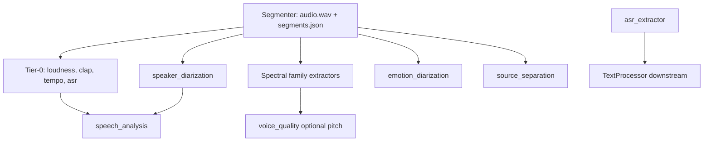

# AudioProcessor — Extractor Dependencies & Segment Families

Каноничная карта для portfolio и production.  
Источник truth в коде: `src/core/dependency_resolver.py`, `src/core/segments_loader.py`.

Связано: [NORMALIZATION_WAVE2.md](NORMALIZATION_WAVE2.md), [TESTING_GUIDE.md](TESTING_GUIDE.md)

---

## 1. Upstream (вне AudioProcessor)

| Зависимость | Контракт | Fail-fast |
|-------------|----------|-----------|
| **Segmenter** | `audio/audio.wav`, `audio/segments.json` (`audio_segments_v1`) | Нет файлов → CLI error |
| **dp_models** | Локальные модели (Whisper, CLAP, pyannote, …) | No-network policy |
| **TextProcessor** (downstream) | `asr_extractor` token IDs | ASR должен быть в профиле, если нужен текст |

---

## 2. Segmenter families → extractors

| `families.*` | Extractor(s) | Примечание |
|--------------|--------------|------------|
| `primary` | `loudness_extractor` | Tier-0 |
| `clap` | `clap_extractor` | Tier-0 |
| `tempo` | `tempo_extractor`, `rhythmic_extractor` | rhythmic принимает legacy `families.rhythmic` |
| `asr` | `asr_extractor` | Tier-0; downstream TextProcessor |
| `diarization` | `speaker_diarization_extractor` | Окно на всё аудио |
| `emotion` | `emotion_diarization_extractor` | GPU + HF cache |
| `source_separation` | `source_separation_extractor` | GPU |
| `spectral` | `spectral_extractor`, `pitch_extractor`, `band_energy_extractor`, `spectral_entropy_extractor` | Shared family (Audit v3) |
| `quality` | `quality_extractor` | |
| `mfcc` | `mfcc_extractor` | |
| `mel` | `mel_extractor` | |
| `onset` | `onset_extractor` | |
| `chroma` | `chroma_extractor` | |
| `voice_quality` | `voice_quality_extractor` | |
| `hpss` | `hpss_extractor` | |
| `key` | `key_extractor` | |

**Prod-правило:** Segmenter — единственный владелец sampling. Extractors не генерируют сегменты сами.

---

## 3. Optional in-process dependencies (shared_features)

Из `dependency_resolver.py` — **не** auto-add в граф, но ускоряют/улучшают результат:

| Extractor | Опционально использует | Эффект без зависимости |
|-----------|------------------------|-------------------------|
| `key_extractor` | `chroma_extractor` | Считает chroma сам |
| `band_energy_extractor` | `spectral_extractor` | Считает STFT сам |
| `spectral_entropy_extractor` | `spectral_extractor` | Считает STFT/Mel сам |
| `voice_quality_extractor` | `pitch_extractor` | Может читать f0 из debug `.npy` |

---

## 4. Bundle / conditional dependencies

### `speech_analysis_extractor`

Агрегирует результаты других extractors из `extractor_results` (не запускает ML внутри).

| Feature flag | Требует extractor | Тип |
|--------------|-------------------|-----|
| `enable_asr_metrics` | `asr_extractor` | conditional required |
| `enable_diarization_metrics` | `speaker_diarization_extractor` | conditional required |
| `enable_pitch_metrics` + pitch | `pitch_extractor` | optional |

**Prod:** если флаг включён, зависимый extractor должен быть в конфиге и выполнен **раньше** в том же run.

### Downstream вне AudioProcessor

| Consumer | Зависит от |
|----------|------------|
| `TextProcessor` | `asr_extractor` (token IDs → текст) |

---

## 5. Tier & compute class

| Класс | Extractors |
|-------|------------|
| **Tier-0 (baseline)** | `clap_extractor`, `loudness_extractor`, `tempo_extractor`, `asr_extractor` |
| **GPU / model-heavy** | `asr_extractor`, `clap_extractor`, `emotion_diarization_extractor`, `source_separation_extractor`, `speaker_diarization_extractor` |
| **CPU spectral** | `spectral`, `band_energy`, `chroma`, `mel`, `mfcc`, `pitch`, … |
| **Bundle / analytics** | `speech_analysis_extractor` |

---

## 6. Порядок выполнения (логический)

Автоматический topological sort: `resolve_extractor_dependencies()` (сейчас почти пустой граф hard-deps; порядок в основном из конфига/DAG).

---

## 7. Production smoke checklist

Минимальная проверка перед релизом / после изменений в AudioProcessor:

| # | Шаг | Команда / критерий |
|---|-----|-------------------|
| 1 | HF cache (emotion) | `./DataProcessor/scripts/prepare_hf_cache.sh` |
| 2 | Smoke all 21 | `./DataProcessor/scripts/run_smoke_all_components.sh` |
| 3 | Validate NPZ | `./DataProcessor/scripts/validate_smoke_results.sh` → **21/21** |
| 4 | Tier-0 вручную (опционально) | `clap`, `loudness`, `tempo`, `asr` — status ok/empty, schema_version в meta |
| 5 | No-fallback | Пустой `segments.json` family → run **падает**, не «тихий» ноль |
| 6 | Models offline | Нет сетевых запросов при run (`dp_models` only) |
| 7 | Артефакты | `dp_results/smoke_test/youtube/smoke_*/*/` — NPZ + manifest |

Подробности: [TESTING_GUIDE.md](TESTING_GUIDE.md)

---

## 8. Статус документа

- Версия: v1 (Wave 2)
- Обновлять при изменении `dependency_resolver.py` или `segments_loader.py`
---

## Навигация

[README](README.md) · [Module README](../README.md) · [AudioProcessor](MAIN_INDEX.md) · [DataProcessor](../../docs/MAIN_INDEX.md) · [Vault](../../../docs/MAIN_INDEX.md)
