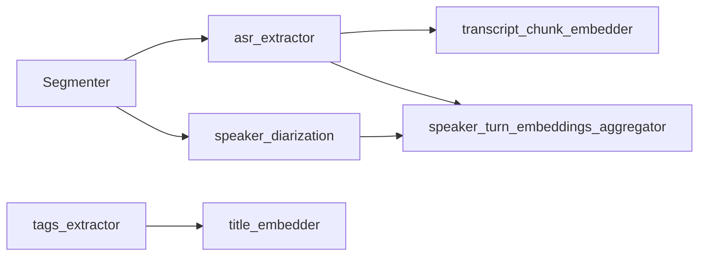

# TextProcessor — Extractor Dependencies & Audit Order

Каноничная карта для portfolio и production.  
Источники: [TEXTPROCESSOR_AUDIT_V3_PREFLIGHT_RULES.md](../../docs/audit_v3/TEXTPROCESSOR_AUDIT_V3_PREFLIGHT_RULES.md), [component_graph.yaml](../../docs/reference/component_graph.yaml) (`text_processor_tier0`), [MAIN_INDEX.md](MAIN_INDEX.md).

Связано: [NORMALIZATION_WAVE3.md](NORMALIZATION_WAVE3.md)

---

## 1. Upstream (вне TextProcessor)

| Зависимость | Контракт | Prod / Audit v3 |
|-------------|----------|-----------------|
| **Segmenter** | `audio/audio.wav`, frames, metadata paths | Обязателен для ASR path |
| **AudioProcessor `asr_extractor`** | token IDs / transcript policy | **Обязателен** в Audit v3 (no skip) |
| **AudioProcessor `speaker_diarization_extractor`** | speaker turns | Рекомендован для `speaker_turn_embeddings_aggregator` |
| **VideoDocument** | `title`, `description`, `comments`, … | JSON input per run |
| **dp_models** | `intfloat/multilingual-e5-large` | Единая embedding модель, offline only |
| **Corpus / FAISS packs** | `pack_version`, `pack_digest` | Для top-k / cluster extractors (см. `config/corpus_packs.placeholder.yaml`) |

**Prod-правило:** один `platform_id` / `video_id` / `run_id` для Segmenter, Audio, Text в одном прогоне.

---

## 2. Каноничный layout документации (TextProcessor)

В отличие от AudioProcessor (`docs/README.md`), здесь принят layout:

```text
src/extractors/<name>/
  README.md
  SCHEMA.md
  docs/FEATURE_DESCRIPTION.md
```

Все **22** extractors соответствуют (проверено Wave 3).

---

## 3. Порядок аудита / Tier (22 extractors)

### Tier-0 (независимые / первыми)

| # | Extractor | Hard deps | Soft / cross-processor |
|---|-----------|-----------|-------------------------|
| 1 | `tags_extractor` | — | **Первый** если включён; мутация doc (очистка `#`) |
| 2 | `lexico_static_features` | `tags_extractor` (DAG) | ASR transcript (`asr_only` policy) |
| 3 | `asr_text_proxy_audio_features` | `tags_extractor` (DAG) | `asr_extractor` (soft) |

### Tier-1 (embeddings, e5-large)

| # | Extractor | Hard deps | Notes |
|---|-----------|-----------|-------|
| 4 | `title_embedder` | `tags_extractor` | После очистки title |
| 5 | `description_embedder` | `tags_extractor` | |
| 6 | `hashtag_embedder` | tags из `tags_extractor` | |
| 7 | `transcript_chunk_embedder` | ASR transcript | |
| 8 | `comments_embedder` | — | |
| 9 | `speaker_turn_embeddings_aggregator` | transcript + diarization | См. §4 |

### Tier-2 (aggregations / pairs / topics)

| # | Extractor |
|---|-----------|
| 10 | `transcript_aggregator` |
| 11 | `comments_aggregator` |
| 12 | `qa_embedding_pairs_extractor` |
| 13 | `embedding_pair_topk_extractor` |
| 14 | `semantics_topics_keyphrases` |

### Tier-3 (metrics / corpus / clusters)

| # | Extractor |
|---|-----------|
| 15 | `embedding_stats_extractor` |
| 16 | `cosine_metrics_extractor` |
| 17 | `title_embedding_cluster_entropy_extractor` |
| 18 | `title_to_hashtag_cosine_extractor` |
| 19 | `semantic_cluster_extractor` |
| 20 | `topk_similar_titles_extractor` |
| 21 | `embedding_shift_indicator_extractor` |
| 22 | `embedding_source_id_extractor` |

Полный DAG для tier0 в коде: `component_graph.yaml` → `text_processor_tier0`. Остальные tiers — в `MainProcessor` / runtime config.

---

## 4. Критические cross-processor цепочки



### `tags_extractor` (hard policy)

- Должен выполняться **до** embedders, ожидающих очищенные `title`/`description`.
- Нарушение порядка → **fail** в аудите (см. preflight §5).

### ASR (hard for Audit v3)

- `transcript_source_policy="asr_only"` для строгих прогонов.
- `asr_text_proxy_audio_features` имеет soft dep на `asr_extractor` в DAG.

### Speaker diarization (recommended)

- `speaker_turn_embeddings_aggregator` без diarization → document empty/degraded в README + audit report.

---

## 5. Corpus-dependent extractors

| Extractor | Pack / index | До фиксации pack |
|-----------|--------------|------------------|
| `topk_similar_titles_extractor` | similar_titles corpus | analytics only |
| `title_embedding_cluster_entropy_extractor` | cluster pack | analytics only |
| `semantic_cluster_extractor` | semantic_clusters_v1 | analytics only |

Минимум для pack «closed»: `pack_version`, `pack_digest`, anti-leakage note в SCHEMA.

---

## 6. Production / Audit smoke checklist

| # | Шаг | Команда / критерий |
|---|-----|-------------------|
| 1 | Models root | `DP_MODELS_ROOT` → `text/embeddings/intfloat/multilingual-e5-large` |
| 2 | venv | `TextProcessor/.tp_venv` (рекомендуется) |
| 3 | Smoke 22×1 scenario | `scripts/smoke_each_extractor_audit_v3.py` |
| 4 | Smoke all scenarios | `... --all-scenarios` (долго; опционально pre-release) |
| 5 | ASR в run | Segmenter + `asr_extractor` + Text same `run_id` |
| 6 | tags first | Порядок: `tags_extractor` перед title/description embedders |
| 7 | No-network | Только `dp_models` / ModelManager |
| 8 | NPZ meta | `models_used[]`, `model_signature`, `schema_version` |

Сценарии: `example/text_audit_v3_smoke/scenarios/`  
Подробности: [example/text_audit_v3_smoke/scenarios/README.md](../../../example/text_audit_v3_smoke/scenarios/README.md)

Preflight: [TEXTPROCESSOR_AUDIT_V3_PREFLIGHT_RULES.md](../../docs/audit_v3/TEXTPROCESSOR_AUDIT_V3_PREFLIGHT_RULES.md)

---

## 7. Статус документа

- Версия: v1 (Wave 3)
- Обновлять при изменении `component_graph.yaml` или preflight rules
---

## Навигация

[TextProcessor](MAIN_INDEX.md) · [DataProcessor](../../docs/MAIN_INDEX.md) · [Vault](../../../docs/MAIN_INDEX.md)
