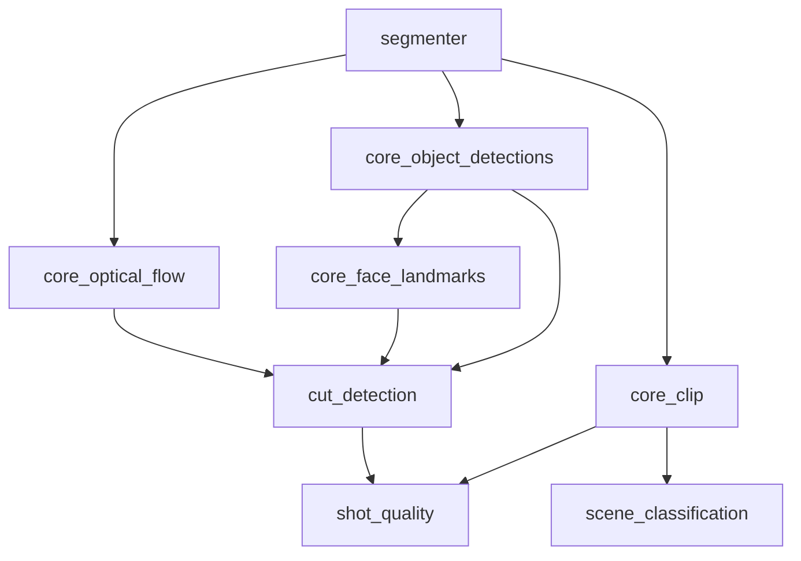

# VisualProcessor — Component Dependencies & Baseline DAG

Каноничная карта для portfolio и production.  
Источники: [component_graph.yaml](../../docs/reference/component_graph.yaml) (`stages.baseline`), README компонентов, [PRODUCTION_READINESS_AND_SCALE_PLAN.md](PRODUCTION_READINESS_AND_SCALE_PLAN.md).

Связано: [NORMALIZATION_WAVE4.md](NORMALIZATION_WAVE4.md) · [COMPONENT_GRAPH_INDEX.md](../../docs/reference/COMPONENT_GRAPH_INDEX.md)

---

## 1. Upstream (вне VisualProcessor)

| Зависимость | Контракт | Prod |
|-------------|----------|------|
| **Segmenter** | `frames_dir`, `metadata.json`, `frame_indices` | Единственный владелец sampling |
| **Triton** (GPU paths) | CLIP, MiDaS, RAFT, YOLO, … | Offline models in `triton/` + `dp_models` |
| **dp_models** | ModelManager, no-network | Обязательно для audited runs |
| **Embedding Service** | semantic heads (brand, place, face, …) | Offline DB + `db_digest` |
| **OpenFace** (micro_emotion) | Docker image | Hard dep, no-fallback |

**Canonical result store:** `DataProcessor/dp_results/` или S3 (`storage/`).  
Локальные `VisualProcessor/result_store/` и `VisualProcessor/state/` — **generated** (в `.gitignore`).

---

## 2. Каноничный doc layout (VisualProcessor)

```text
<core|module|identity>/<name>/
  README.md
  SCHEMA.md              # или docs/SCHEMA.md (face_identity)
  docs/FEATURE_DESCRIPTION.md
```

Machine schemas: `VisualProcessor/schemas/<component>_npz_v*.json`

**Исключения (Wave 4 audit):**
- `failing_module` — dev/test only, без `FEATURE_DESCRIPTION` (намеренно)
- `face_identity` — `docs/SCHEMA.md` (не корень)

---

## 3. Baseline DAG (из `component_graph.yaml`)

### Tier-0 core providers (после Segmenter)

| Component | Hard deps | Soft deps |
|-----------|-----------|-----------|
| `core_clip` | segmenter | — |
| `core_object_detections` | segmenter | — |
| `core_depth_midas` | segmenter | — |
| `core_optical_flow` | segmenter | — |
| `core_face_landmarks` | segmenter, core_object_detections | — |
| `ocr_extractor` | segmenter, core_object_detections | — |
| `content_domain` | segmenter, core_clip | — |
| `franchise_recognition` | segmenter, core_clip | ocr_extractor |

### Tier-0 modules (baseline)

| Component | Hard deps |
|-----------|-----------|
| `cut_detection` | segmenter, core_optical_flow, core_face_landmarks, core_object_detections |
| `shot_quality` | segmenter, cut_detection, core_clip, core_depth_midas, core_object_detections, core_face_landmarks |
| `scene_classification` | segmenter, core_clip |
| `video_pacing` | segmenter, core_optical_flow, core_clip |
| `uniqueness` | segmenter, core_clip |
| `story_structure` | segmenter, core_clip, core_optical_flow, core_face_landmarks |



---

## 4. Дополнительные модули (README / код, вне полного DAG в yaml)

| Component | Hard deps (типично) | GPU / infra |
|-----------|---------------------|-------------|
| `color_light` | scene_classification | CPU |
| `action_recognition` | core_object_detections | SlowFast + ModelManager |
| `behavioral` | core_face_landmarks | CPU |
| `emotion_face` | core_face_landmarks | EmoNet |
| `detalize_face` | core_face_landmarks | CPU |
| `micro_emotion` | core_face_landmarks | OpenFace Docker |
| `frames_composition` | core_object_detections, core_face_landmarks, core_depth_midas | CPU |
| `high_level_semantic` | core_clip, cut_detection, emotion_face | CPU |
| `optical_flow` (module) | core_optical_flow | reuse core |
| `similarity_metrics` | core_clip | CPU |
| `text_scoring` | ocr / frames (см. README) | CPU |
| `failing_module` | — | **test only**, always fails |

### Semantic heads (`core_identity/*`)

| Component | Hard deps |
|-----------|-----------|
| `brand_semantics`, `car_semantics`, `place_semantics` | core_object_detections, core_clip, offline DB |
| `content_domain`, `franchise_recognition` | core_clip (+ optional OCR) |
| `face_identity` | core_face_landmarks, embedding service / FAISS |

---

## 5. Tier / baseline narrative (portfolio)

| Уровень | Компоненты | Смысл для демо/прода |
|---------|------------|----------------------|
| **Baseline required** | segmenter → core_clip, cod, flow, face_lm → cut_detection | Минимальный «скелет» видео-аналитики |
| **Baseline extended** | scene_classification, shot_quality, video_pacing, uniqueness | Продуктовые метрики монтажа/сцен |
| **Semantics** | identity heads, high_level_semantic | Требуют offline bases + seed |
| **Heavy optional** | micro_emotion (OpenFace), action_recognition (SlowFast) | Явно помечать cost/deps |

---

## 6. Production / smoke checklist

| # | Шаг | Критерий |
|---|-----|----------|
| 1 | Segmenter | `metadata.json` + sampled frames в `frames_dir` |
| 2 | Triton | Health + model repo смонтирован (`triton/README.md`) |
| 3 | Core smoke | `core/model_process/run_all_core_components.py` или e2e profile |
| 4 | Baseline modules | `cut_detection` + `core_optical_flow` reuse (no local Farneback) |
| 5 | NPZ validate | `utils/validate_*.py` per component (exit 0) |
| 6 | No-fallback | Missing hard dep → **error**, не silent zeros |
| 7 | Observability | Prometheus/Grafana (`DataProcessor/monitoring/`) |
| 8 | Scale plan | [PRODUCTION_READINESS_AND_SCALE_PLAN.md](PRODUCTION_READINESS_AND_SCALE_PLAN.md) P0 закрыты |

E2E (full stack): `backend/docs/E2E_RUNBOOK.md`, `backend/scripts/start_e2e_stack.sh`

---

## 7. Doc coverage summary (Wave 4, 2026-05-28)

| Зона | Count | README | SCHEMA | FEATURE |
|------|-------|--------|--------|---------|
| Core providers | 6 | 6/6 | 6/6 | 6/6 |
| core_identity | 6 | 6/6 | 6/6* | 6/6 |
| Modules | 17 | 17/17 | 17/17 | 16/17** |

\* `face_identity`: `docs/SCHEMA.md`  
\*\* `failing_module`: test utility, FEATURE не требуется

---

## 8. Статус документа

- Версия: v1 (Wave 4)
- Обновлять при расширении `component_graph.yaml` или смене baseline policy
---

## Навигация

[Module README](../README.md) · [VisualProcessor](MAIN_INDEX.md) · [DataProcessor](../../docs/MAIN_INDEX.md) · [Vault](../../../docs/MAIN_INDEX.md)
