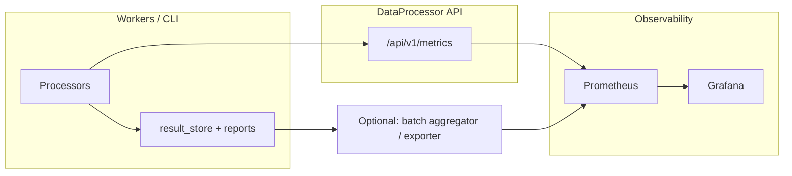

# План подготовки к большому прогону (60+ видео)

**Статус:** рабочий план (черновик для согласования).  
**Дата:** 2026-04-15  
**Чеклист к исполнению (запуск только после Go в §7 чеклиста):** [CHECKLIST_LARGE_VIDEO_BATCH_60PLUS.md](CHECKLIST_LARGE_VIDEO_BATCH_60PLUS.md)  
**Артефакты батча 60+ (реестр, матрица, профиль full max, версии моделей, задачи владельца, waivers, метрики):** [VIDEO_REGISTRY_60PLUS.yaml](VIDEO_REGISTRY_60PLUS.yaml), [scripts/validate_video_registry_60plus.py](scripts/validate_video_registry_60plus.py), [BATCH_FULL_PROFILE_REFERENCE.md](BATCH_FULL_PROFILE_REFERENCE.md), [BATCH_MODEL_VERSIONS_SNAPSHOT.md](BATCH_MODEL_VERSIONS_SNAPSHOT.md), [COVERAGE_MATRIX_60PLUS.md](COVERAGE_MATRIX_60PLUS.md), [BATCH_60PLUS_OWNER_TASKS.md](BATCH_60PLUS_OWNER_TASKS.md), [BATCH_60PLUS_WAIVERS.md](BATCH_60PLUS_WAIVERS.md), [METRICS_LABELS_INVENTORY_60PLUS.md](METRICS_LABELS_INVENTORY_60PLUS.md)  
**Связанные документы:** [AUDIT_4_CRITERIA_AND_PLAN.md](AUDIT_4_CRITERIA_AND_PLAN.md) (§3 наборы B/C, §12 массовый E2E и 4.2), [AUDIT_V4_2_L2_CROSS_PROCESSORS_SUMMARY.md](AUDIT_V4_2_L2_CROSS_PROCESSORS_SUMMARY.md), [AUDIT_V4_L1_CROSS_PROCESSORS_SUMMARY.md](AUDIT_V4_L1_CROSS_PROCESSORS_SUMMARY.md), [AUDIT_V4_L1_AUDIO_PROCESSOR_SUMMARY.md](AUDIT_V4_L1_AUDIO_PROCESSOR_SUMMARY.md), [AUDIT_V4_L1_TEXT_PROCESSOR_SUMMARY.md](AUDIT_V4_L1_TEXT_PROCESSOR_SUMMARY.md), [AUDIT_V4_L1_VISUAL_PROCESSOR_SUMMARY.md](AUDIT_V4_L1_VISUAL_PROCESSOR_SUMMARY.md), [VISUAL_PROCESSOR_AUDIT_V4_SUMMARY.md](VISUAL_PROCESSOR_AUDIT_V4_SUMMARY.md) (L2-оценки), индекс отчётов [components/README.md](components/README.md), [RUN_LOG.md](RUN_LOG.md), [components/audit_4_2/README.md](components/audit_4_2/README.md).

## 1. Цель и границы

**Цель:** перед массовым прогоном **≥60 видео** заранее снизить риск «дорогого» забега: стабильный код, осмысленная выборка контента и **непрерывная наблюдаемость** во время прогона.

**Вне scope этого плана:** выбор конкретного оркестратора запуска (CI, k8s, bare metal), юридические ограничения на контент, финальный SLA продукта.

**Ожидаемый результат подготовки:**

- Пройден чеклист оптимизаций / регрессий по критичным компонентам.
- Зафиксирован **реестр 60+** `video_id` (и при необходимости `run_id`) с **тегами осей** (см. §3.2), покрывающий хвосты из аудита.
- Развёрнут контур **метрик + дашборды** (минимум: API/воркер; желательно: агрегаты по экстракторам в реальном времени).

---

## 2. Фаза A — Оптимизации и устойчивость кода

### 2.1 Принципы

- Не оптимизировать «вслепую»: опираться на **L2 JSON**, **engineering logs 4.2** и **§12.4 gate** там, где меняется боевой путь.
- Любые ускорения с **env-gate** (как в Audio: `AP_*`, в других процессорах — принятые префиксы), чтобы откат не требовал релиза.
- После заметных правок — **точечный повтор** L2-скрипта или короткого E2E на **2–3** видео из текущего набора B.

### 2.2 Порядок работ (по подсистемам)

| Подсистема | Откуда брать подсказки | Действия |
|------------|------------------------|----------|
| **AudioProcessor** | `audit_4_2/audio_processor/*`, [ORCHESTRATOR_TELEMETRY.md](../../AudioProcessor/docs/ORCHESTRATOR_TELEMETRY.md), сводка L2 | Пройти экстракторы с тяжёлым GPU/сегментами; включить телеметрию оркестратора на пилоте; сверить tabular/meta после фиксов саверов |
| **VisualProcessor** | `VISUAL_PROCESSOR_AUDIT_V4_SUMMARY.md`, engineering logs core/modules | Закрыть **blocked** (`micro_emotion`) и слабые места (**`action_recognition`** на вырожденной оси); проверить модули с высокой долей NaN на B |
| **TextProcessor** | Кросс-сводка L1+L2, `*_l2/*_stats.json` | **Приоритет:** устранить **сквозной** провал **3/5** `text_processor` на наборе B — иначе массовый прогон не даст табличных фич для сравнения |

### 2.3 Минимальный чеклист перед 60+

- [ ] Нет известных **блокеров** уровня «падение пайплайна до NPZ» на репрезентативном поднаборе (≥5 видео).
- [ ] Для Audio: при необходимости — повтор **A** после фиксов (см. [AUDIT_V4_L1_AUDIO_PROCESSOR_SUMMARY.md](AUDIT_V4_L1_AUDIO_PROCESSOR_SUMMARY.md)).
- [ ] Для Text: **5/5** успешных `text_processor` на том же типе конфига, что будет в большом прогоне (или явное исключение компонентов из критерия успеха батча).
- [ ] Критичные пути покрыты **профилированием** (хотя бы однократно) — см. §12.4.6 и журналы 4.2.

---

## 3. Фаза B — Подбор 60+ видео (кураторская матрица)

Идея: не «случайные 60», а **стратифицированный набор** по осям, чтобы одновременно кормить Audio, Visual и Text и не получить вырожденные метрики.

### 3.1 Оси контента (теги для реестра)

Каждому видео в реестре задаются теги (можно в YAML/таблице: `video_id`, длительность, язык, теги…):

| Ось | Примеры значений | Зачем |
|-----|------------------|--------|
| **Длительность** | короткое (&lt;60 с), среднее, длинное (&gt;10 мин) | темпо/rhythm, сегментные режимы, кэши |
| **Речь / музыка / тишина** | преимущественно речь, музыка, смесь, почти тишина | ASR, VAD, audio stats |
| **Нарезка / динамика** | много склеек, длинные планы | cut_detection, action_recognition, pacing |
| **Лица** | нет / редко / плотно | face modules, diar в связке с визуалом |
| **Текст на кадре** | мало / много субтитров, низкий контраст | OCR, text_scoring |
| **Язык / регион** | en, ru, mixed | ASR, лексика, topics |
| **Плотность комментариев / метаданных** | богатый title/desc/tags/comments | TextProcessor embedders, cosine, comments |
| **Транскрипт** | whisper-only, второй источник, много чанков | transcript chain, aggregators, stats |
| **Кадров / сегментатор** | мало кадров, типичный N | Visual core, shot_quality |

### 3.2 Покрытие требований компонентов (логика, не исчерпывающий список)

Свести в **одну таблицу** (рекомендуемый артефакт: `docs/audit_v4/VIDEO_REGISTRY_60PLUS.yaml` или CSV в репозитории после согласования):

- **Столбцы:** компонент / группа (или ссылка на строку L1 «Следующие шаги») → **какой тег оси обязателен** → **минимум N видео** в батче.
- **Строки:** брать из пунктов «Следующие шаги» в [AUDIT_V4_L1_TEXT_PROCESSOR_SUMMARY.md](AUDIT_V4_L1_TEXT_PROCESSOR_SUMMARY.md), [AUDIT_V4_L1_VISUAL_PROCESSOR_SUMMARY.md](AUDIT_V4_L1_VISUAL_PROCESSOR_SUMMARY.md), [AUDIT_V4_L1_AUDIO_PROCESSOR_SUMMARY.md](AUDIT_V4_L1_AUDIO_PROCESSOR_SUMMARY.md) — там уже перечислены нужные ветки (B/C).

**Правило баланса:** если для хвоста компонента нужно редкое видео (например diar+ASR для `speaker_turn_embeddings_aggregator`), закладываем **≥2** экземпляра такого класса, чтобы один outlier не ломал интерпретацию.

### 3.3 Минимальные критерии качества набора

- [ ] **≥60** уникальных `video_id` (или согласованное число с запасом на отвал).
- [ ] Каждая **ось** из §3.1 представлена **минимум в 3–5** видео (кроме намеренно редких классов).
- [ ] Явно помечены **edge** кейсы для набора **C** (короткое, пустое аудио, нет лица и т.д.) — хотя бы подмножеством.
- [ ] Реестр версионируется (hash списка id + дата + конфиг pipeline).

---

## 4. Фаза C — Качественный вывод фич и наблюдаемость (Prometheus / Grafana)

### 4.1 Что уже есть в репозитории

- **DataProcessor API:** метрики Prometheus (`dataprocessor_queue_*`, `dataprocessor_processing_seconds{processor,component}`, `dataprocessor_failures_total`, ресурсы) — см. [api/services/metrics.py](../../api/services/metrics.py), [monitoring/README.md](../../monitoring/README.md), [monitoring/prometheus/prometheus.yml](../../monitoring/prometheus/prometheus.yml).
- **Audio:** оркестраторная телеметрия → `scheduler_runtime_report.json` при включённом `AP_ORCHESTRATOR_TELEMETRY` — см. [ORCHESTRATOR_TELEMETRY.md](../../AudioProcessor/docs/ORCHESTRATOR_TELEMETRY.md).

### 4.2 Целевая архитектура на время большого прогона

**Минимум (быстрый старт):** поднять Prometheus + Grafana, скрейпить **существующий** endpoint API; дашборды: очередь, активные run, latency по `processor`/`component`, ошибки.

**Расширение (рекомендуется для «показательности»):**

1. **Единые labels:** `platform_id`, `video_id`, `run_id`, `processor` (`audio`/`visual`/`text`), `component`, `pipeline_version` / `config_hash` (где возможно без кардинальных изменений контрактов).
2. **Гистограммы времени** по каждому крупному шагу (уже частично через `dataprocessor_processing_seconds` — убедиться, что воркер пробрасывает **реальные** имена компонентов).
3. **Счётчики успех/фейл** по компоненту и типу ошибки (уже есть `failure_rate` — проверить покрытие всех путей).
4. **Optional:** sidecar или периодический job, который читает **L2-подобные** агрегаты (доли NaN, `meta.status`) из свежих NPZ / маленьких summary JSON и пушит в Prometheus (например через Pushgateway) **раз в N минут** — чтобы на дашборде были не только «время», но и «качество фич».

### 4.3 Работы по метрикам (чеклист)

- [ ] Инвентаризация: какие **компоненты** сегодня попадают в `processing_time` labels при массовом запуске через API.
- [ ] Пробелы: Text/Visual при прямом CLI — попадают ли события в API-метрики; если нет — **единый слой** экспорта (общая библиотека или запись в совместимый формат + отдельный exporter).
- [ ] Grafana: **1** обзорный дашборд (весь батч) + **3** по подсистемам (или фильтры).
- [ ] Алерты (опционально): рост `failures_total`, застой очереди, аномалия p95 времени по компоненту.
- [ ] Документировать в [RUN_LOG.md](RUN_LOG.md) или `monitoring/README.md`: URL Grafana, retention, как смотреть прогон 60+.

### 4.4 Связь с файлами статистик (L2)

- Скрипты `audit_v4_npz_stats.py` — эталон **пост-фактум** качества NPZ.
- Для **онлайна** достаточно лёгких сигналов: `meta.status`, число ключей, доля NaN по заранее выбранным слотам (без полного пересчёта L2 на каждом run — слишком дорого). Имеет смысл определить **10–20** cheap-метрик на подсистему для экспорта.

---

## 5. Последовательность и вехи

| Этап | Содержание | Выход |
|------|------------|--------|
| **B0** | Зафиксировать конфиг большого прогона (профиль YAML, версии моделей) | `config_hash` в доке |
| **B1** | Фаза A: оптимизации + устранение блокеров (особенно Text5/5) | Обновлённые RUN_LOG / короткие заметки по PR |
| **B2** | Фаза B: реестр 60+ + матрица покрытия | `VIDEO_REGISTRY_60PLUS.*` + sign-off |
| **B3** | Фаза C: Prometheus/Grafana + дашборды + (optional) quality exporter | Ссылка на дашборды, скрин/описание панелей |
| **B4** | Сухой прогон **5–10** видео из реестра на **боевом** пути с включёнными метриками | Отчёт: метрики совпадают с ожиданиями, нет дыр |
| **Go** | Подпись владельца аудита / техлида | Запуск 60+ |

---

## 6. Критерии Go / No-Go

**Go**, если выполнено:

- Нет незакрытого **сквозного** блокера уровня TextProcessor (**2/5** OK) без явного исключения из целей батча.
- Реестр 60+ покрывает оси §3.1 и критичные строки из аудита (матрица §3.2 заполнена).
- Prometheus собирает метрики с **реальных** воркеров; на пилоте 5–10 видео дашборды отражают прогресс и ошибки.

**No-Go**, если:

- Массовый запуск даст преимущественно **пустые** `text_features` или массовый `meta.status=error` при целевом сравнении компонентов.
- Нет наблюдаемости (слепой прогон 60+).

---

## 7. Риски

| Риск | Митигация |
|------|-----------|
| Дрейф конфига между пилотом и батчем | Один `config_hash`, артефакт в git или lockfile |
| Перегруз метриками (latency) | Cheap counters + выборочные histograms |
| Непредставительный контент | Стратификация §3.1 + минимальные квоты |
| Долгий откат оптимизаций | Env-gates и feature flags |
| **Интерпретация NaN как «бага»** | Заранее разделить в дашбордах *ожидаемые* NaN (маски, `emit_extra_metrics=false`, отсутствие лица) и *аномальные*; опора на отчёты в [components/](components/) |
| **Разный N кадров по модулям** | В реестре фиксировать фактический Segmenter / ожидаемый N; не сравнивать «в лоб» модули с разной политикой сэмплинга без нормализации |
| **OCR / privacy** | При `retain_raw_ocr_text=false` не ждать сырого текста в метриках качества OCR — только счётчики/флаги ([`ocr_extractor`](components/visual_processor/core/ocr_extractor_audit_v4.md), `text_scoring`) |
| **FAISS vs numpy (Text)** | В метаданных прогона или в cheap-метриках фиксировать `backend_faiss`; иначе распределения top‑K/кластеров на 60+ несопоставимы ([FAISS_AND_NUMPY_BACKEND.md](../../TextProcessor/docs/FAISS_AND_NUMPY_BACKEND.md)) |

---

## 8. Рекомендации и советы по результатам аудита компонентов

Ниже — практические дополнения к фазам A–C, собранные из сводок L1/L2, кросс-процессорного итога и каталога [components/](components/). Имеет смысл использовать их как **чеклист для владельцев подсистем** перед батчем.

### 8.1 Сквозные (все процессоры)

- **Дисциплина tabular vs meta.** Для Audio не допускать попадания строковых полей (`device_used`, `backend`, `f0_method`, …) во float-tabular как «тихий» NaN — при расхождении сразу смотреть саверы и §4.1a плана. Для Text/Visual трактовать NaN только вместе с флагами **`present`**, масками (`valid_mask`, `processed_mask`, `face_present`).
- **`meta.features_enabled` ↔ факт.** Перед 60+ прогоном выборочно проверить, что заявленные ветки реально смёржены (типичный пример аудита: `speech_analysis` и pitch). Иначе часть таблицы будет систематически NaN без ошибки пайплайна.
- **Один reference A не заменяет B/C.** Кросс-сводка прямо указывает: короткое аудио, пустые семантики, второй источник транскрипта, другой Segmenter, edge OCR — должны попасть в реестр 60+ как **отдельные страты**, а не как случайный хвост.
- **Git commit + config_hash в RUN_LOG.** До батча зафиксировать воспроизводимость (п. общих шагов кросс-сводки) — иначе сравнение «до/после» на 60+ бессмысленно.

### 8.2 AudioProcessor (L2 закрыт — фокус на качестве батча)

- **Сегментный режим:** для экстракторов с `run_segments` убедиться в **полноте payload** (`hop_length`, `n_fft`, `duration` и т.д.) на пилоте — иначе на части видео получите систематические NaN без падения (см. `spectral_extractor` и тему в audio-сводке).
- **Повтор A после фиксов саверов:** в сводке явно: старые артефакты в storage могут не отражать текущий код — для golden и чистых долей NaN заложить **пересборку** хотя бы опорного run.
- **Набор C (edge) в реестре:** тишина, слишком короткое аудио, пограничные семейства сегментов — не обязательно все 60+, но **≥2** явных кейса снизят риск сюрпризов после батча.
- **Long-run 4.2:** для сравнения «до/после» оптимизаций на большом прогоне заранее включить контур **`scheduler_runtime_report.json`** / `AP_ORCHESTRATOR_TELEMETRY` на пилоте и решить, публиковать ли агрегаты в Prometheus (post-batch или редкий scrape custom exporter).

### 8.3 VisualProcessor

- **Маски и семантика вероятностей.** Потребители и дашборды должны опираться на маски и документацию: top‑k **не обязан** суммироваться в 1 (`scene_classification`, `shot_quality`, `core_clip` и др.); первый кадр / отсутствие лица дают **ожидаемые** NaN в flow/face цепочках.
- **Разная ось N.** Один run может иметь разный N у разных модулей (пример: **N=48** vs **N=120** у `text_scoring`) — в метаданных батча фиксировать политику Segmenter **по модулям** или не смешивать в одной панели Grafana несопоставимые ряды.
- **`micro_emotion`:** по L2-сводке компонент **blocked** на части B-run — до 60+ либо **исправить PCA/вход**, либо явно **исключить** из критериев успеха батча и из SLA метрик.
- **`action_recognition` (критерий при подборке видео):** пилот A+B дал **вырожденную** ось (`metric__num_clips=1` на каждом треке, см. [BATCH_60PLUS_WAIVERS.md](BATCH_60PLUS_WAIVERS.md) **W3**). Для реестра 60+ заложить **минимум ~3 видео**, на которых после полного прогона в `action_recognition_features.npz` выполняется **хотя бы одно** из: (1) у **≥1** трека `metric__num_clips ≥ 2`; (2) в L2-агрегате по этим run `tracks_with_multi_clips_total > 0`. Практически это контент с **person** в кадре **достаточно долго и с разрывами/сменами сегмента**, чтобы пайплайн нарезал **несколько клипов на трек** (не один непрерывный блок кадров). Проверка: скрипт `VisualProcessor/modules/action_recognition/scripts/audit_v4_npz_stats.py` → JSON в `storage/audit_v4/action_recognition_l2/`, либо точечный разбор NPZ (`metric__num_clips`).
- **`meta.models_used`:** добить заполнение там, где модель явно работала, а поле пустое (в кросс-сводке отмечено как долг; сделано точечно для `shot_quality`) — иначе downstream и алерты по «модель не записана» будут шуметь на всём батче.
- **Детекции без треков.** `core_object_detections` не содержит track id — любые метрики «трекинга» на этом NPZ вводят в заблуждение; в реестре/дашбордах не смешивать с модулями, ожидающими треки.
- **OCR и приватность.** Учитывать `retain_raw_ocr_text`: при выключенном хранении сырого текста качественные метрики по тексту на кадре ограничены — планировать **отдельный внутренний** прогон при необходимости отладки OCR.

### 8.4 TextProcessor

- **Сквозной блокер 2/5 OK.** Пока `text_processor` падает на 3/5 путей набора B, батч 60+ даст **несопоставимые** табличные срезы — это приоритет №1 (см. [AUDIT_V4_2_L2_CROSS_PROCESSORS_SUMMARY.md](AUDIT_V4_2_L2_CROSS_PROCESSORS_SUMMARY.md)).
- **`emit_extra_metrics` / `compute_std`.** Для массового прогона решить **единую политику**: либо `true` для диагностических полей (дороже), либо осознанно `false` и тогда **не** трактировать пустые слоты как сбой на дашбордах. Учесть исключения: title/description/hashtag embedder (флаг не гейтит `features_flat` в v1.2.0) vs transcript/comments/tchunk и др.
- **Транскрипт и чанки.** В реестр включить видео с **≥2 чанками** whisper, с **`youtube_auto`**, с длинным текстом — иначе `embedding_stats`, `embedding_shift`, `embedding_pair_topk`, `transcript_aggregator` останутся на «узком» режиме, как на A.
- **Корпусные экстракторы (`topk_similar_titles`, кластеры).** Заложить видео/конфиги, где отрабатывают **numpy vs FAISS**, большой корпус, режимы `export_topk_mode` / `require_faiss` — см. нумерованные пункты text-сводки.
- **Связка Audio → Text.** Для `speaker_turn_embeddings_aggregator` и сценариев с diar нужны видео с **перекрытием diar + ASR** (пункт 17 text-сводки) — отдельная редкая страта, минимум **2** экземпляра.
- **Комментарии и QA.** Отдельно стратифицировать «богатые комментарии» / «почти нет» и контент с **вопросительными конструкциями** для `qa_embedding_pairs_extractor`.

### 8.5 Использование каталога `components/*_audit_v4.md`

- Перед батчем пройти **не вердикт**, а разделы **рисков / следующих шагов / NaN** в отчётах своей подсистемы — они задают **конкретные теги** для реестра 60+.
- Где есть [engineering log 4.2](components/audit_4_2/README.md) — сверить, какие **env** и профилирование уже приняты; не дублировать эксперименты без фиксации в `RUN_LOG`.

### 8.6 После прогона: контроль качества артефактов

- **Выборочный пост-аудит:** на **5–10** случайных run из батча прогнать существующие `audit_v4_npz_stats.py` (или облегчённые проверки) — сравнить доли NaN/ошибок с L2 baseline.
- **Манифест / `meta.status`:** единый отчёт по батчу (даже CSV): `run_id`, процессор, статус, время, топ ошибка — привязать к дашборду или к ежедневному отчёту.
- **Диск и retention:** 60+ полных прогонов быстро занимают storage; заранее политика хранения сырья vs NPZ vs отчётов.

### 8.7 Организационные советы

- **Заморозка конфига** на окно батча (отдельная ветка или тег релиза) — исключает спор «какой код писал NPZ».
- **Пилот 5–10** из реестра обязателен не только для метрик, но и для **end-to-end времени** на реальной очереди (очередь, ретраи, лимиты GPU).
- **План отката:** если после N видео алерт показывает системный сдвиг (например, рост `failures_total` по одному компоненту) — заранее порог **стоп-крана** (например, пауза после 10 подряд ошибок одного типа).

---

## 9. Следующий шаг после согласования плана

1. Вести работы по **[CHECKLIST_LARGE_VIDEO_BATCH_60PLUS.md](CHECKLIST_LARGE_VIDEO_BATCH_60PLUS.md)** до подписи **§7** чеклиста.
2. Назначить **владельца** реестра видео и **владельца** наблюдаемости (п. 0.1–0.2 чеклиста).
3. Создать тикеты по строкам чеклиста и по приоритетным пунктам **§8** плана (особенно Text 5/5, `micro_emotion`, `action_recognition`, audio payload сегментов).
4. После **B4** — запись в [RUN_LOG.md](RUN_LOG.md) о готовности к батчу 60+ (дата, commit, ссылка на реестр и Grafana).
---

## Навигация

[Audit v4 hub](components/audit_4_2/README.md) · [DataProcessor](../MAIN_INDEX.md) · [Vault](../../../docs/MAIN_INDEX.md)
